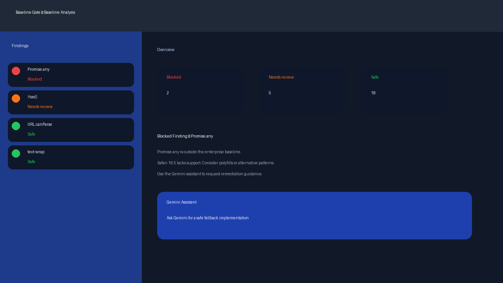
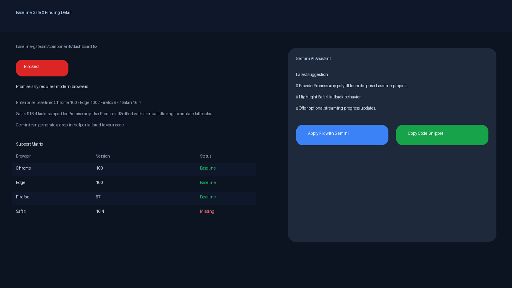

# BaselineGate for VS Code

BaselineGate surfaces Baseline browser support data directly inside VS Code so you can catch incompatible JavaScript and CSS features before shipping. Hover tooltips, an insights dashboard, and an AI-assisted detail view keep you informed and help you remediate issues without leaving the editor.

## Table of Contents
- [Key Features](#key-features)
- [Screenshots](#screenshots)
- [Getting Started](#getting-started)
- [Using BaselineGate](#using-baselinegate)
- [Commands](#commands)
- [Configuration](#configuration)
- [Gemini AI Workflow](#gemini-ai-workflow)
- [Development](#development)
- [Testing](#testing)
- [Packaging & Release](#packaging--release)
- [Project Structure](#project-structure)
- [Documentation](#documentation)
- [Troubleshooting](#troubleshooting)
- [Limitations & Roadmap](#limitations--roadmap)
- [License](#license)

## Key Features
- **Hover intelligence** – Detects Baseline-capable JS/CSS tokens and renders support tables with fallback guidance inline.
- **Analysis dashboard** – Scans the workspace, summarises findings by severity, and lets you drill into files and features.
- **Detail view** – Presents rich metadata, support matrices, and remediation steps for each finding.
- **Gemini integration** – Ask Google Gemini for fixes, capture follow-up questions, and keep conversations grouped by feature.
- **Storage-aware insights** – Persist scans, AI conversations, and filters inside `.baseline-gate` for project-level history.
- **Status reminders** – Status bar target indicator and quick actions so teams can align on `enterprise` vs `modern` goals.

## Screenshots



## Getting Started
1. **Prerequisites**
   - VS Code `^1.90.0`
   - Node.js 18+
   - `pnpm` (recommended) or `npm`
2. **Install dependencies**
   ```bash
   pnpm install
   ```
3. **Launch the extension**
   - Open the **Run and Debug** view (`Ctrl`/`Cmd` + `Shift` + `D`).
   - Choose **Run Extension** and press **F5**. VS Code compiles with webpack watch mode and opens an Extension Development Host.

## Using BaselineGate
1. **Hover over APIs/selectors** – Type `Promise.any`, `URL.canParse`, `:has(...)`, or `@container` and hover to see support badges.
2. **Run a workspace scan** – Execute `Baseline Gate: Scan Workspace` from the command palette. Findings appear in the analysis webview.
3. **Filter and sort** – Use the webview toolbar to filter by severity, search by token/file, and toggle between severity vs file order.
4. **Inspect details** – Click any finding to open the detail panel with support matrices, docs, and remediation notes.
5. **Get AI help** – Trigger **Fix with Gemini** from a hover, the dashboard, or the detail panel to request guided fixes. Follow-ups stay threaded per feature.

## Commands
| Command | Description |
| --- | --- |
| `Baseline Gate: Scan Workspace` | Analyse JS/CSS files for unsupported features. |
| `Baseline Gate: Search Findings` | Filter results by token, feature, or filename. |
| `Baseline Gate: Filter by Severity` | Choose which verdicts (blocked, needs review, safe) remain visible. |
| `Baseline Gate: Clear Filters` | Reset search, severity filters, and sort order. |
| `Baseline Gate: Toggle Sort Order` | Switch between severity weighting and source order. |
| `Baseline Gate: View Insights` | Reveal the analysis dashboard if hidden. |
| `Baseline Gate: Open Settings` | Jump straight to the BaselineGate settings page. |
| `Baseline Gate: Start Gemini Chat` | Open the AI-assisted detail view for a selected finding. |
| `Baseline Gate: View Existing Suggestions` | Focus the dashboard on AI conversations for a finding. |
| `Baseline Gate: Open Gemini Suggestions in Full View` | Expand Gemini threads into a dedicated panel. |
| `Baseline Gate: Clear All BaselineGate Data` | Remove stored findings and Gemini transcripts from `.baseline-gate`. |

## Configuration
All settings live under **Extensions → BaselineGate** or via `settings.json`.
- `baselineGate.target`: `"enterprise"` (default) or `"modern"`.
- `baselineGate.showDesktopBrowsers`: Toggle Chrome, Edge, Firefox, Safari columns.
- `baselineGate.showMobileBrowsers`: Toggle Chrome Android, Firefox Android, Safari iOS.
- `baselineGate.geminiApiKey`: Google Gemini API key for AI features.
- `baselineGate.geminiModel`: Override the default `gemini-2.0-flash` model.
- `baselineGate.geminiCustomPrompt`: Prepend custom guidance to each AI request.
- `baselineGate.blockedBudget` / `baselineGate.warningBudget` / `baselineGate.safeGoal`: Track progress against internal quality targets.

## Gemini AI Workflow
1. Configure `baselineGate.geminiApiKey` (and optional model/prompt overrides).
2. Request a suggestion from a hover, the dashboard, or a detail panel.
3. BaselineGate sends contextual data (feature, file, verdict, severity) to Gemini.
4. Responses persist per feature, keeping follow-up questions grouped even across sessions.
5. Use **Open Gemini Suggestions in Full View** for a multi-pane conversation history.

## Development
- **Compile once**: `pnpm run compile`
- **Watch mode**: `pnpm run watch`
- **Compile TypeScript tests**: `pnpm run compile-tests`
- **Lint**: `pnpm run lint`
- **Development host**: use the built-in **Run Extension** launch configuration (ships source maps).

## Testing
- `pnpm test` runs type-checking, webpack build, ESLint, and the VS Code integration harness. It passes with the committed configuration.
- Run only the compiled test suites via `pnpm exec node out/test/suite/index.js` after `pnpm run compile-tests` if you need quick iterations.
- The Testing view in VS Code exposes named run profiles for both extension execution and integration tests.

## Packaging & Release
- Create a VSIX locally with:
  ```bash
  pnpm exec vsce package --no-dependencies
  ```
- CI workflow: `.github/workflows/vsce-release.yml` builds, packages, and (optionally) publishes when the `VSCE_PAT` secret is configured. Trigger via tags (`v*`) or manual dispatch.

## Project Structure
- `src/extension.ts`: Activation entry point and command registration.
- `src/hover/`: JavaScript and CSS hover providers.
- `src/core/`: Baseline data loading, scoring, and resolution.
- `src/sidebar/analysis/`: Workspace scan dashboard assets.
- `src/sidebar/detailView/`: Finding detail panel, HTML generator, and state management.
- `src/gemini/`: Gemini provider, data transforms, and UI assets.
- `media/`: Icons and webview imagery (including status/baseline SVGs).
- `docs/`: Historical design notes, implementation summaries, and guides.

## Documentation
All supplementary documentation lives in the [`docs/`](docs) directory. Files are grouped by theme (Gemini, storage, UI, testing) and use kebab-case naming for easy discovery.

## Troubleshooting
- **No hover content**: Hover directly over the token (e.g., the `any` in `Promise.any`). The initial detector is position-sensitive.
- **Missing support columns**: Inspect `web-features/data.json` to confirm the data shape and adjust `src/core/baselineData.ts` if necessary.
- **Build errors on JSON imports**: Ensure `resolveJsonModule` remains enabled in `tsconfig.json`.
- **Extension does not compile during F5**: Confirm the **Run Extension** configuration is selected; it wires webpack watch mode automatically.
- **Test pipeline failures**: Run `pnpm run lint -- --max-warnings=0` to surface remaining lint issues before re-running `pnpm test`.

## Limitations & Roadmap
- Hover detectors rely on heuristic string matching; migrating to TypeScript AST/PostCSS parsing will improve accuracy.
- Baseline feature maps are seeded with high-value APIs/selectors; expand to cover project-specific needs.
- Data normalisation follows the current `web-features` schema; monitor upstream changes and adjust resolvers when necessary.

## License
BaselineGate is released under the [MIT License](LICENSE).
